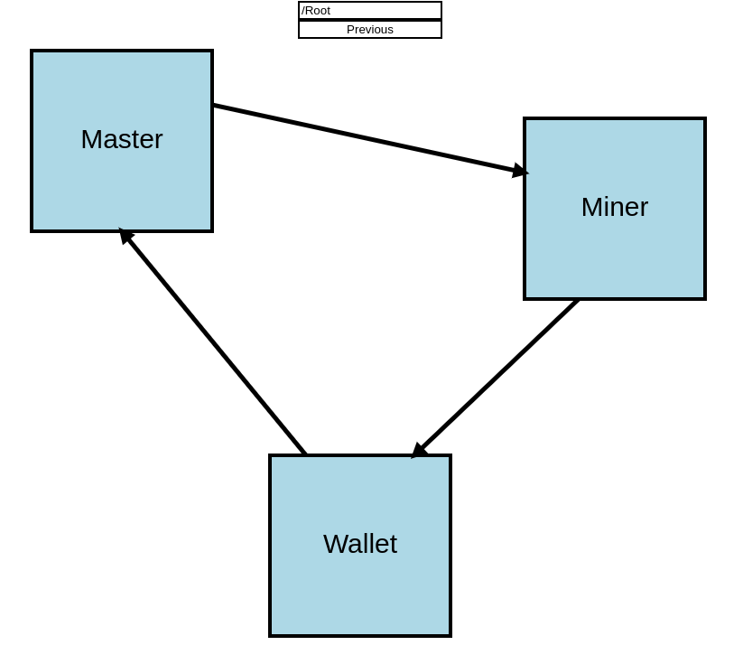

# Welcome to the capT project !

This project was made from scratch in one day! Here is a screenshot of it :)

## Installation

In the project directory, you can run:

`npm install`

and then do 

`npm start`

Open [http://localhost:3000](http://localhost:3000) to view the result in your browser.

## Usage

Everything should be accessible with the mouse:
- move around the boxes
- change what the arrows are pointing to and from
- zoom inside boxes
- go back with the Previous button

Also, the page reloads if you change `src/diagram.json`.
