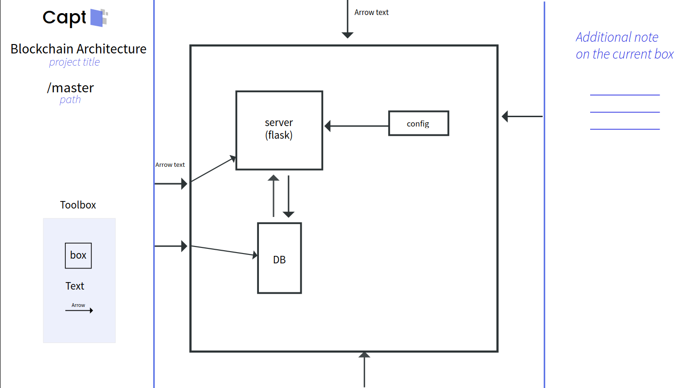

# Welcome to the Capt project !

A visual collaboration tool to describe any project architecture to possibly the smallest detail level.
Describe a detail level with boxes, text and arrows. Zoom into a box: repeat.

This project was made from scratch in one day! Here what it looks like

## Installation

In the project directory, run:

`npm install`

and then:

`npm start`

Open [http://localhost:3000](http://localhost:3000) to view the result in your browser.

## Usage

Everything should be accessible with the mouse:

- move around the boxes
- change what the arrows are pointing to and from
- zoom inside boxes
- go back with the Previous button

Also, the page reloads if you change `src/diagram.json`.
